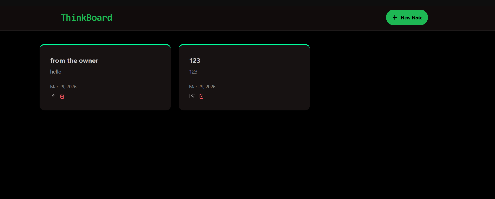
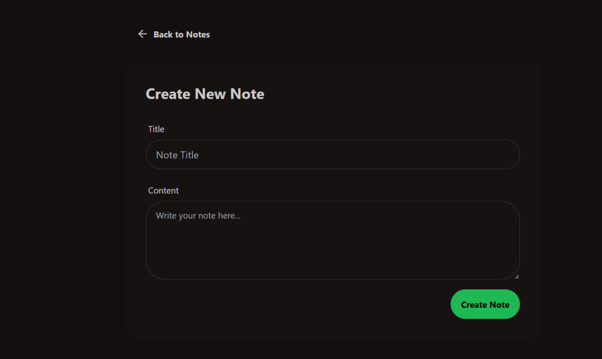
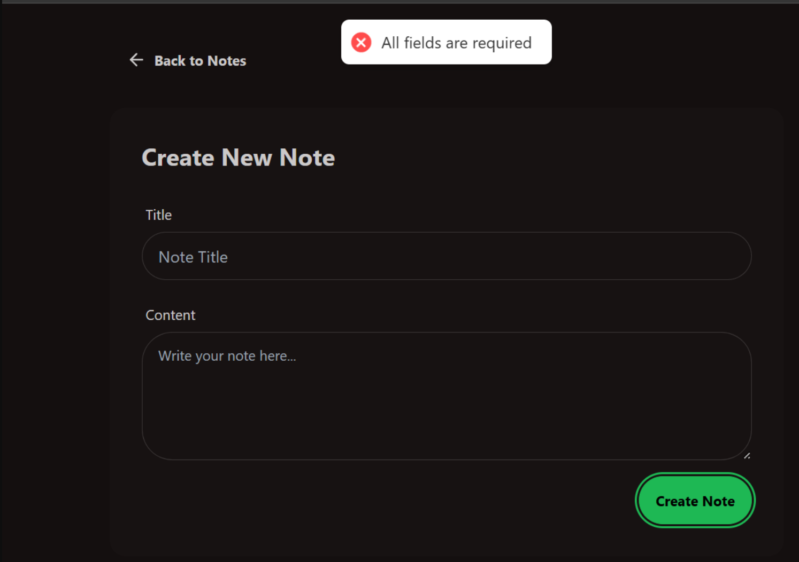
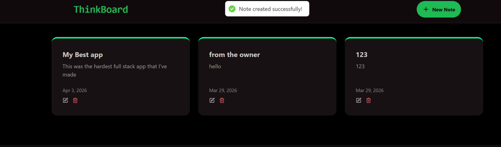

# 📝 ThinkBoard

**ThinkBoard** is a streamlined, full-stack notes management application built with the MERN stack. It focuses on a clean, distraction-free user experience with robust backend logic to handle data persistence and real-time state updates.

---

## 🚀 Key Features

* **Full CRUD Functionality:** Create, read, update, and delete notes with instant UI feedback.
* **Smart Validation:** Integrated frontend and backend validation to ensure data integrity (e.g., preventing empty submissions).
* **Toast Notifications:** Real-time success and error alerts for a smooth, responsive user experience.
* **Responsive Dark UI:** A minimalist design optimized for focus, utilizing a custom dark theme.

## 🛠️ Technical Stack

* **Frontend:** React
* **Backend:** Node.js, Express.js
* **Database:** MongoDB (via Mongoose)
* **Styling:** Tailwind CSS

### 📸 Project Preview

  
  

  
  

---

### 🧠 Lessons Learned

This was one of the most challenging full-stack builds I've completed. It pushed me to refine how the frontend communicates with a REST API-specifically ensuring that the UI stays in sync with the database without unnecessary re-renders.

I focused heavily on user feedback, ensuring that every action-whether it fails or succeeds-is clearly communicated back to the user through visual cues and toast notifications.
